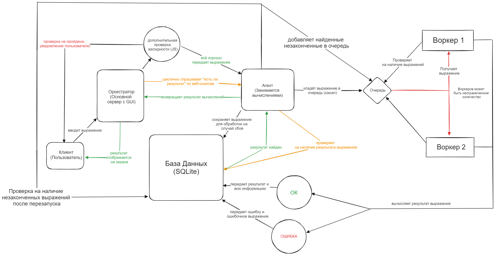

# GoCompCalc - проект по Go

Маленький итоговый проект состоящий из двух серверов. Один с GUI, предназначенный для пользователя, второй для вычислений. Пользователь вводит на сайте в поле выражение -> результат будет отображен на экране спустя n-ное количество времени (данное время настраивается в пункте **настройки** на сайте)

## ER-Диаграмма
Изображение ER-диаграммы для описания работы находится в файле ER.jpg



## Установка
Для запуска проекта требуется:

1. Клонирование репозитория:
    ```
    git clone https://github.com/MuhaFAH/GoCompCalc.git
    ```
2. Установка необходимых зависимостей:
    ```
    go mod tidy
    ```
3. Запуск:
    ```
    go run cmd/main.go
    ```

4. Перейти на следующий URL: http://localhost:3000 ([Нажми сюда](http://localhost:3000))

Создание базы данных, работа двух серверов (оркестратор и агент) происходят **АВТОМАТИЧЕСКИ**!
Приятного использования **<3**
